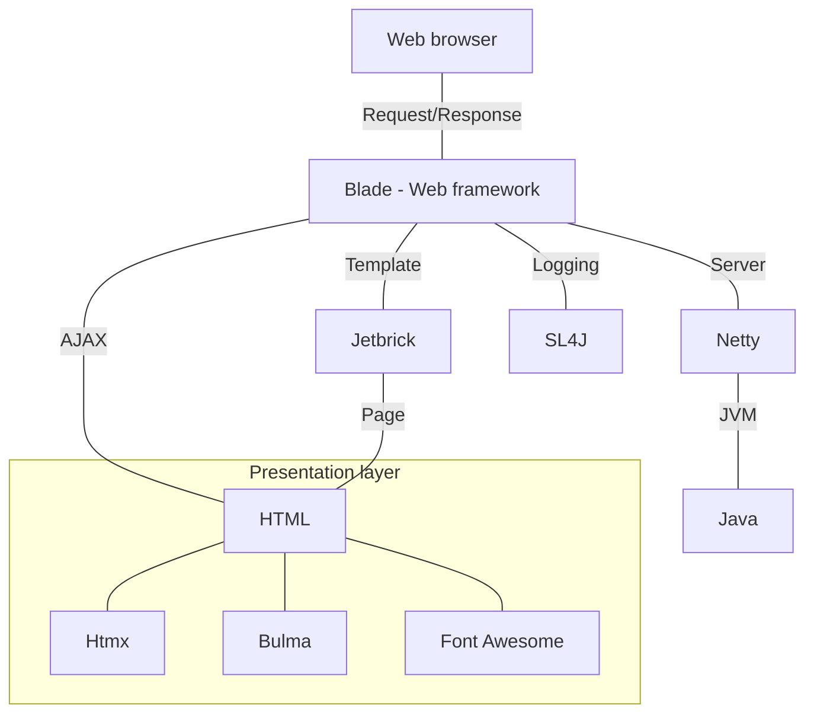

## Web example basic (to-do application)

### Table of contents </span>
1. [Version](https://github.com/murtidaryandono/example-web-basic#1-version) <br/>
2. [Description](https://github.com/murtidaryandono/example-web-basic#2-description) <br/>
3. [Technology stack](https://github.com/murtidaryandono/example-web-basic#3-technology-stack) <br/>
4. [Architecture](https://github.com/murtidaryandono/example-web-basic#4-architecture) <br/>
5. [Flow diagram](https://github.com/murtidaryandono/example-web-basic#5-flow-diagram) <br/>
6. [Sequence diagram](https://github.com/murtidaryandono/example-web-basic#6-sequence-diagram) <br/>
7. [Database design](https://github.com/murtidaryandono/example-web-basic#7-database-design) <br/>
8. [API producer](https://github.com/murtidaryandono/example-web-basic#8-api-producer) <br/>
9. [API consumer](https://github.com/murtidaryandono/example-web-basic#9-api-consumer) <br/>
10. [Project structure](https://github.com/murtidaryandono/example-web-basic#10-project-structure) <br/>
11. [Development steps](https://github.com/murtidaryandono/example-web-basic#11-development-steps) <br/>
12. [Environment properties](https://github.com/murtidaryandono/example-web-basic#12-environment-properties) <br/>
13. [Running application](https://github.com/murtidaryandono/example-web-basic#13-running-application) <br/>
14. [Tools](https://github.com/murtidaryandono/example-web-basic#14-tools) <br/>
15. [Author](https://github.com/murtidaryandono/example-web-basic#15-author)
---

### 1. Version

| Date | Version | Author | Changelog |
| --- | --- | --- | --- |
| 2022-02-07 | 1.0.0 | Murti Daryandono | Initial release |
---

### 2. Description

**Web example basic (project : example-web-basic)** is a sample project that intended to help Java developers create basic web application using Java
based technologies based on MVC (Model View Controller) concept.
In this sample project, we will create to-do application with some feature will be provided, such as :
- Page templating
- Read environment properties
- Service class based on business logic to-do list
- Controller class to handle request and response (show, add, remove & update to-do list)
- Create UI for to-do list
- Test application
---

### 3. Technology stack

- Blade : Java web framework (here are [blade link](https://github.com/lets-blade/blade) & [baeldung link](https://www.baeldung.com/blade))
- Gson : JSON manipulation tools from Google ([Gson link](https://github.com/google/gson))
- Jetbrick : Java page templating ([Jetbrick link](https://github.com/lets-blade/blade-demos/tree/master/blade-template))
- SL4J : Java logging framework
- Project Lombok : Java getter & setter auto generation ([Project Lombok link](https://projectlombok.org/))
- JUnit : Java unit test framework
- Htmx : HTML framework ([Htmx link](https://htmx.org/))
- Bulma : CSS framework ([Bulma link](https://bulma.io/))
- Font Awesome : Font framework ([Font Awesome link](https://fontawesome.com/))
---

### 4. Architecture


---

### 5. Flow diagram

TBD

---

### 6. Sequence diagram

1. Index page
    - Path (GET) : /todo
    - Diagram
      ```mermaid
      sequenceDiagram
      participant Requestor
      participant Controller
      participant Service
      participant Page
      Requestor ->> Controller : HTTP GET request "/todo"
      Controller ->> Service : Process request
      Service ->> Page : Load index.html
      Page -->> Service : Return index.html
      Service -->> Controller : Process response
      Controller -->> Requestor : Render page
      ```
    - Response
      ```html
      <!DOCTYPE html>
      <html lang="en">
      <head>
        <meta charset="UTF-8">
        <title>To-do list application</title>
        <link href="/static/css/bulma.min.css" rel="stylesheet"/>
        <script src="/static/js/htmx.min.js"></script>
      </head>
      <body>
        <div>
            <table>
                <thead>
                    <tr>
                        ...
                    </tr>
                </thead>
                <tbody>
                    <tr>
                        <!-- list of to-do here -->
                    </tr>
                </tbody>
            </table>
        </div>
      </body>
      ```

2. Add to-do item on the list
   - Path (POST) : /todo
   - Query param : todoItem
   - Diagram
     ```mermaid
     sequenceDiagram
     participant Requestor
     participant Controller
     participant Service
     Requestor ->> Controller : HTTP POST request "/todo"
     Controller ->> Service : Add to-do list (query param "todoItem")
     Service -->> Controller : Return to-do list ("<tr>...</tr>")
     Controller -->> Requestor : Render page
     ```
   - Response
     ```html
     <tr>
        <!-- to-do list -->
     </tr>
     ```

3. Remove to-do item on the list
    - Path (DELETE) : /todo
    - Query param : todoId
    - Diagram
      ```mermaid
      sequenceDiagram
      participant Requestor
      participant Controller
      participant Service
      Requestor ->> Controller : HTTP DELETE request "/todo"
      Controller ->> Service : Remove to-do list (query param "todoId")
      Service -->> Controller : Return to-do list ("<tr>...</tr>")
      Controller -->> Requestor : Render page
      ```
    - Response
      ```html
      <tr>
         <!-- to-do list -->
      </tr>
      ```

4. Update to-do item on the list
   - Path (PUT) : /todo
   - Query param : todoId, todoItem
   - Diagram
     ```mermaid
     sequenceDiagram
     participant Requestor
     participant Controller
     participant Service
     Requestor ->> Controller : HTTP PATCH request "/todo"
     Controller ->> Service : Update to-do list (query param "todoId, todoItem")
     Service -->> Controller : Return to-do list ("<tr>...</tr>")
     Controller -->> Requestor : Render page
     ```
   - Response
     ```html
     <tr>
        <!-- to-do list -->
     </tr>
     ```

### 7. Database design

N/A

---

### 8. API producer

N/A

---

### 9. API Consumer

N/A

---

### 10. Project structure

TBD

---

### 11. Development steps

TBD

---

### 12. Environment properties

| Environment | File properties | 
| --- | --- |
| Development | application.properties | 
| Staging | application-stg.properties | 
| Production | application-prd.properties |

Contents of environment properties are :

```properties
# server configuration
server.port=[port value where your application will run]

# application configuration
mvc.statics=[path to static directory]
mvc.statics.show-list=[true if you want to be show via url]
```
---

### 13. Running application

- Run in development environment
```
java -jar target/web-example-basic.jar
```
- Run in staging environment
```
java -jar target/web-example-basic.jar --app.env=stg
```
- Run in production environment
```
java -jar target/web-example-basic.jar --app.env=prd
```
---

### 14. Tools

- [Java 8]() as main language
- [Maven]() as dependency manager
- [IntelliJ]() as Java IDE (Integrated Development Environemnt)
- [Mermaid]() as markdown plugin for diagram
---

### 15. Author
> name : Murti Daryandono <br/>
email : murti.daryandono@gmail.com <br/>
twitter : murti_d <br/>
blog : https://daryandono.id
